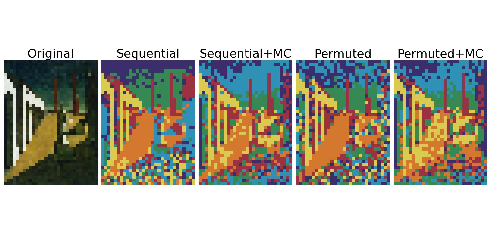
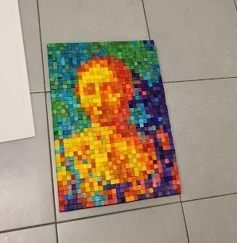

The repository is a collection of various small projects I did for fun over the years.

## CubePainting

I noticed a package of colorful wooden cubes inside the store, and I had an idea to create a painting using these cubes as pixels.

*Figure 1*: The cubes in the packing used to extract the colors for the palette. 

The problem is that the cubes specify a limited color palette. Therefore, I wrote a code that attempts to approximate the figure using the Monte Carlo method using a specific number of pixels with these 7 colors.

*Figure 2*: Examples of different paintings approximated by the palette formed from the cubes.

The sequential and permuted headings refer to whether the image is parsed sequentially or in random order.
In Monte Carlo (MC) transforms, two pixels are randomly swapped, and a check is performed on whether the new configuration of pixels better approximates the original image.

*Figure 3*: The final calculated configuration of the pixels for a chosen image and a finished painting made from the cubes.

## ElectraACRemote

The Arduino code that simulates the remote control used for Electra AC products. The data from the remote was collected using the infrared sensor and analyzed using the IrScrutinizer tool.
After breaking the code, I created an implementation of some basic functionalities of the remote.

*Figure 4*: Nano prototype setup with the IR receiver and remote simulator.
